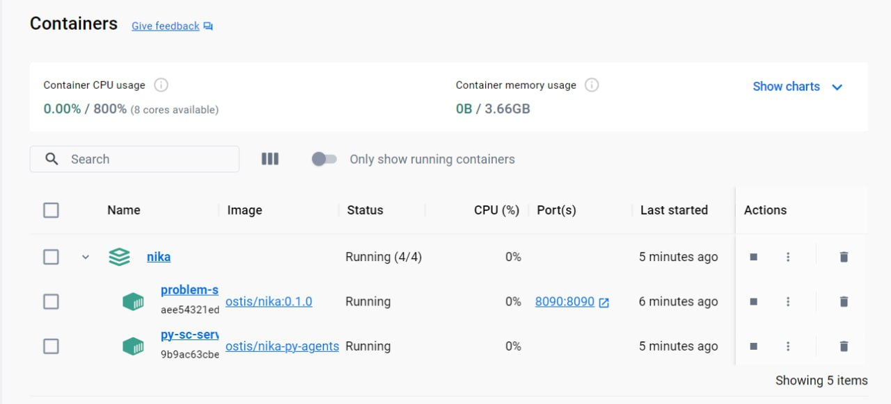
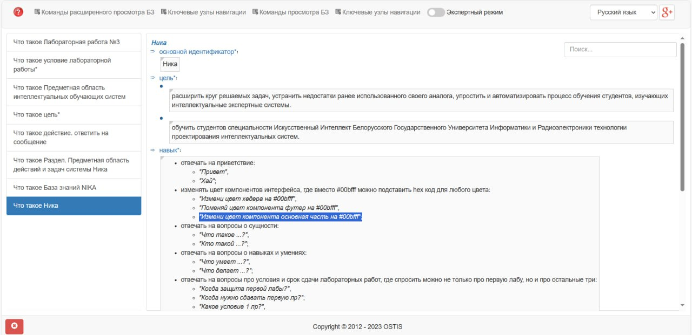
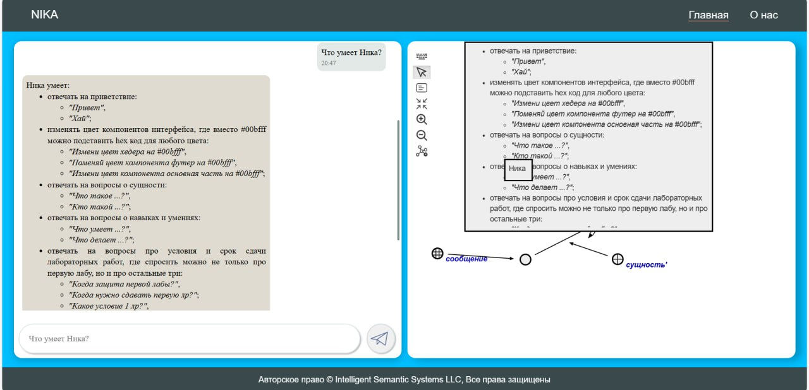
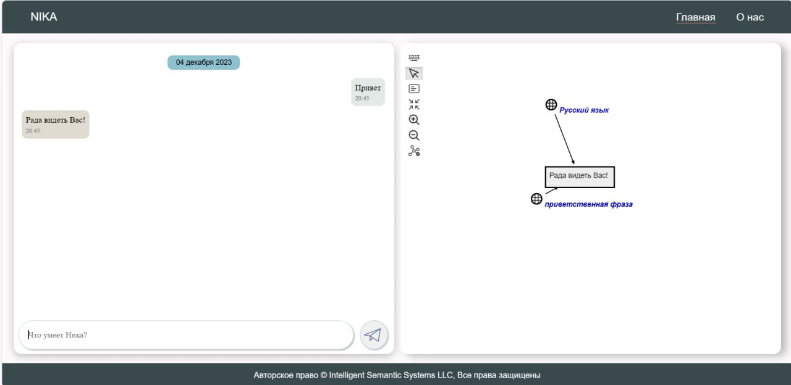
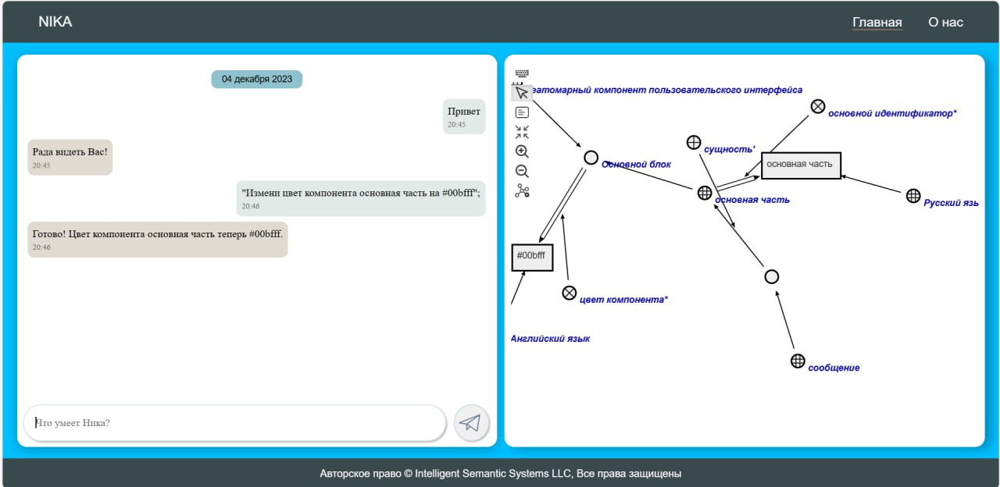

<p align="center"> Министерство образования Республики Беларусь</p>
<p align="center">Учреждение образования</p>
<p align="center">“Брестский Государственный технический университет”</p>
<p align="center">Кафедра ИИТ</p>
<br><br><br><br><br><br><br>
<p align="center">Лабораторная работа №4</p>
<p align="center">По дисциплине “Общая теория интеллектуальных систем”</p>
<p align="center">Тема: “Работа с проектом "NIKA" (Intelligent Knowledge-driven Assistant)”</p>
<br><br><br><br><br>
<p align="right">Выполнил:</p>
<p align="right">Студент 2 курса</p>
<p align="right">Группы ИИ-23</p>
<p align="right">Глухарев Д.Е.</p>
<p align="right">Проверил:</p>
<p align="right">Иванюк Д.С.</p>
<br><br><br><br><br>
<p align="center">Брест 2023</p>

---

# Общее задание #
1. Изучить руководство.

2. Запустить данный проект на локальной машине (домашний персональный компьютер, ноутбук, рабочая машина в аудитории и т.п.). Продемонстрировать работу проекта преподавателю.

3. Написать отчет по выполненной работе в .md формате (readme.md) и с помощью pull request разместить его в следующем каталоге: trunk\ii0xxyy\task_04\doc.


---

# Выполнение задания: #


## Установка:
Установил проект "NIKA" с помощью приложения для Windows под названием Docker и запустил, используя команду:
```
docker compose up --no-build
```
Эта команда запуcкает 2 веб-интерфейса:

sc-веб: ```localhost:8000```

Веб-диалог пользовательского интерфейса: ```localhost:8090```


## Запуск:
Разобрался с системой контейнеров в Docker. Установил и подготовил необходимые файлы для работы: 

##  Изучение проекта:
Запустил проект "NIKA" на своем ПК, изучил функционал данного проекта, а также задал свои вопросы:    

## Вывод:
    Изучил функционал проекта "NIKA", установил на свой ПК и протестировал его.
